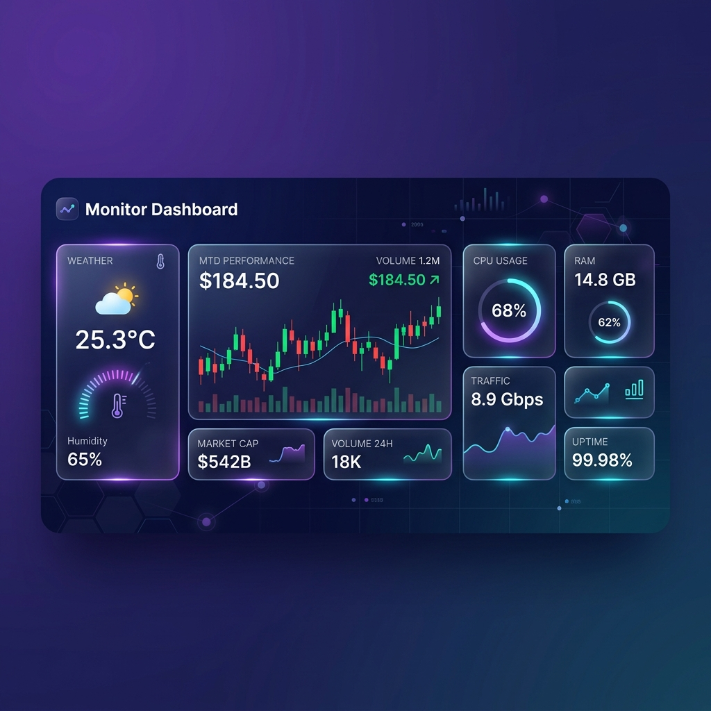

<div align="center">



<br/>
<br/>

# 📊 Monitor Dashboard

### Real-time Weather & Finance Monitoring Platform

<br/>

<a href="https://monitor-dashboard.onrender.com">
  
</a>

<br/>
<br/>

<a href="https://render.com/deploy?repo=https://github.com/Jesus-Emmanuel-Jimenez-Carlos/monitor_dashboard">
  
</a>

<br/>
<br/>

[](https://python.org)
[](https://streamlit.io)
[](https://plotly.com)
[](https://sqlite.org)
[](LICENSE)

<br/>

<p align="center">
  <b>Un dashboard interactivo y moderno</b> que combina datos meteorológicos en tiempo real<br/>
  y cotizaciones financieras en una interfaz premium con tema oscuro glassmorphism.
</p>

<br/>

---

</div>

<br/>

## ✨ Características Principales

<table>
<tr>
<td width="50%">

### 🌤️ Monitoreo del Clima
- Datos en tiempo real vía **Open-Meteo** (sin API key)
- **10 ciudades** preconfiguradas alrededor del mundo
- Gauges interactivos de **temperatura** y **humedad**
- Descripciones del clima con emojis (WMO codes)

</td>
<td width="50%">

### 💹 Cotizaciones Financieras
- Precios en vivo con **yfinance**
- **10 activos**: AAPL, GOOGL, MSFT, BTC-USD, ETH-USD…
- Gráficos de **velas (candlestick)** del último mes
- Gráficos de **volumen** con barras interactivas

</td>
</tr>
<tr>
<td width="50%">

### 🗄️ Persistencia de Datos
- Base de datos **SQLite** con SQLAlchemy ORM
- Guarda snapshots de clima y finanzas con un clic
- Historial consultable con **tablas interactivas**
- Gráficos de línea temporales del historial

</td>
<td width="50%">

### 🎨 Diseño Premium
- Tema oscuro con **glassmorphism** y gradientes
- Tipografía **Inter** (Google Fonts)
- Micro-animaciones **hover** en tarjetas y botones
- 100% **responsive** y optimizado para cualquier pantalla

</td>
</tr>
</table>

<br/>

---

<br/>

## 🚀 Demo en Vivo

> **¿Quieres ver la app funcionando?** Solo haz clic:
>
> 👉 **[monitor-dashboard.onrender.com](https://monitor-dashboard.onrender.com)** 👈
>
> _Sin registro, sin contraseña, sin instalaciones. Acceso inmediato._

<br/>

---

<br/>

## 📁 Estructura del Proyecto

```
monitor_dashboard/
│
├── 📄 app.py                        # Aplicación principal (Streamlit)
├── 📄 requirements.txt              # Dependencias del proyecto
├── 📄 Procfile                      # Configuración para Render
├── 📄 render.yaml                   # Blueprint de despliegue
├── 📄 .gitignore                    # Archivos ignorados por Git
├── 📄 README.md                     # Documentación del proyecto
│
├── 📂 .streamlit/
│   └── config.toml                  # Tema y configuración de Streamlit
│
├── 📂 assets/
│   └── banner.png                   # Banner del README
│
├── 📂 database/
│   ├── __init__.py
│   └── models.py                    # Modelos SQLAlchemy (WeatherLog, FinanceLog)
│
└── 📂 services/
    ├── __init__.py
    ├── weather_service.py           # Servicio de clima (Open-Meteo)
    └── finance_service.py           # Servicio financiero (yfinance)
```

<br/>

---

<br/>

## 🛠️ Tech Stack

<div align="center">

| Tecnología | Rol | Versión |
|:---:|:---:|:---:|
|  | Lenguaje principal | 3.10+ |
|  | Framework web / UI | 1.x |
|  | Gráficos interactivos | 5.x |
|  | Manejo de datos | 2.x |
|  | ORM / Base de datos | 2.x |
|  | Base de datos local | 3 |

</div>

<br/>

---

<br/>

## ⚡ Instalación Local

### Requisitos previos

- **Python 3.10** o superior
- **pip** (incluido con Python)
- Conexión a Internet

### Pasos

```bash
# 1️⃣ Clona el repositorio
git clone https://github.com/Jesus-Emmanuel-Jimenez-Carlos/monitor_dashboard.git
cd monitor_dashboard

# 2️⃣ Crea un entorno virtual
python3 -m venv venv
source venv/bin/activate       # macOS / Linux
# venv\Scripts\activate        # Windows

# 3️⃣ Instala las dependencias
pip install -r requirements.txt

# 4️⃣ Ejecuta la aplicación
streamlit run app.py
```

> 🌐 La app se abrirá automáticamente en **http://localhost:8501**

<br/>

---

<br/>

## 📖 Guía de Uso

<table>
<tr>
<td width="60">1️⃣</td>
<td><b>Selecciona una ciudad</b> en la barra lateral y presiona <code>🔄 Actualizar clima</code></td>
</tr>
<tr>
<td>2️⃣</td>
<td><b>Selecciona un activo financiero</b> y presiona <code>🔄 Actualizar cotización</code></td>
</tr>
<tr>
<td>3️⃣</td>
<td><b>Guarda los datos</b> en SQLite con el botón <code>💾 Guardar</code></td>
</tr>
<tr>
<td>4️⃣</td>
<td><b>Consulta el historial</b> con tablas interactivas y gráficos temporales</td>
</tr>
</table>

### Pestañas del Dashboard

| Pestaña | Contenido |
|:--------|:----------|
| 🌤️ **Clima** | Métricas en tiempo real + gauges de temperatura y humedad |
| 💹 **Finanzas** | Precio, apertura, máx/mín, volumen + candlestick + barras de volumen |
| 🗄️ **Historial** | Tablas de registros guardados + gráficos de línea temporales |

<br/>

---

<br/>

## 🏗️ Arquitectura

```
┌─────────────────┐         ┌────────────────────┐         ┌──────────────┐
│   Open-Meteo    │◄────────│  weather_service    │◄────────│              │
│   (API REST)    │         │      .py            │         │              │
└─────────────────┘         └────────────────────┘         │              │
                                                            │   app.py     │
┌─────────────────┐         ┌────────────────────┐         │  (Streamlit) │
│    yfinance     │◄────────│  finance_service    │◄────────│              │
│   (library)     │         │      .py            │         │              │
└─────────────────┘         └────────────────────┘         └──────┬───────┘
                                                                   │
                            ┌────────────────────┐         ┌──────▼───────┐
                            │    models.py        │◄────────│    SQLite    │
                            │   (SQLAlchemy)      │         │  (.db file)  │
                            └────────────────────┘         └──────────────┘
```

<br/>

---

<br/>

## 🗃️ Modelos de Base de Datos

<details>
<summary><b>WeatherLog</b> — Registros meteorológicos</summary>

<br/>

| Columna | Tipo | Descripción |
|:--------|:-----|:------------|
| `id` | `Integer` | Clave primaria (auto-increment) |
| `city` | `String(120)` | Nombre de la ciudad |
| `latitude` | `Float` | Latitud geográfica |
| `longitude` | `Float` | Longitud geográfica |
| `temperature_c` | `Float` | Temperatura en °C |
| `humidity_pct` | `Float` | Humedad relativa (%) |
| `wind_speed_kmh` | `Float` | Velocidad del viento (km/h) |
| `weather_description` | `String(255)` | Descripción del clima |
| `recorded_at` | `DateTime` | Fecha/hora UTC del registro |

</details>

<details>
<summary><b>FinanceLog</b> — Registros financieros</summary>

<br/>

| Columna | Tipo | Descripción |
|:--------|:-----|:------------|
| `id` | `Integer` | Clave primaria (auto-increment) |
| `symbol` | `String(20)` | Ticker del activo |
| `price` | `Float` | Precio actual |
| `open_price` | `Float` | Precio de apertura |
| `high_price` | `Float` | Precio máximo del día |
| `low_price` | `Float` | Precio mínimo del día |
| `volume` | `Float` | Volumen de operaciones |
| `market_cap` | `Float` | Capitalización de mercado |
| `currency` | `String(10)` | Moneda |
| `recorded_at` | `DateTime` | Fecha/hora UTC del registro |

</details>

<br/>

---

<br/>

## 🌐 APIs Utilizadas

| API | Uso | Autenticación |
|:----|:----|:--------------|
| [Open-Meteo](https://open-meteo.com/) | Datos meteorológicos en tiempo real | ✅ Sin API key |
| [yfinance](https://github.com/ranaroussi/yfinance) | Cotizaciones financieras | ✅ Sin API key |

<br/>

---

<br/>

## 🤝 Contribuciones

¡Las contribuciones son bienvenidas! Sigue estos pasos:

1. 🍴 Haz un **fork** del proyecto
2. 🌿 Crea tu rama (`git checkout -b feature/nueva-funcionalidad`)
3. 💾 Haz commit (`git commit -m 'Agrega nueva funcionalidad'`)
4. 🚀 Push a la rama (`git push origin feature/nueva-funcionalidad`)
5. 📬 Abre un **Pull Request**

<br/>

---

<br/>

## 📝 Licencia

Este proyecto está bajo la licencia **MIT**. Consulta el archivo [`LICENSE`](LICENSE) para más detalles.

<br/>

---

<div align="center">

<br/>

**Hecho con ❤️ usando Python, Streamlit & Plotly**

<br/>

<a href="https://monitor-dashboard.onrender.com">
  
</a>

<br/>
<br/>

</div>
